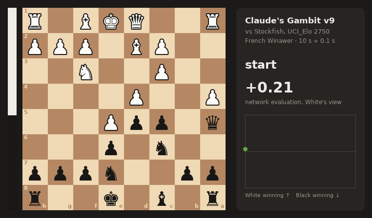
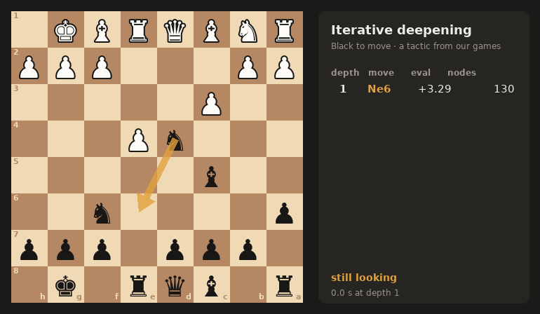
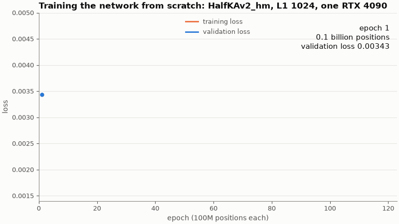
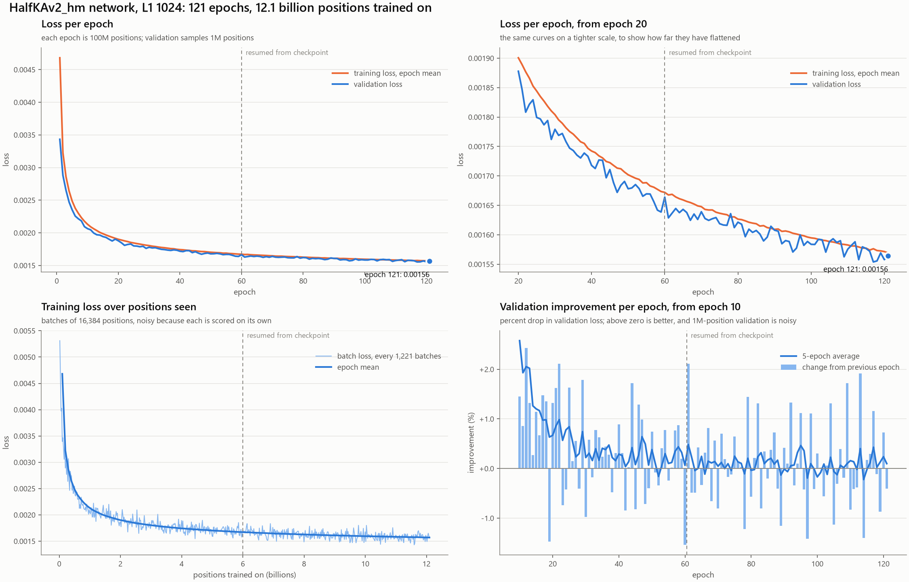
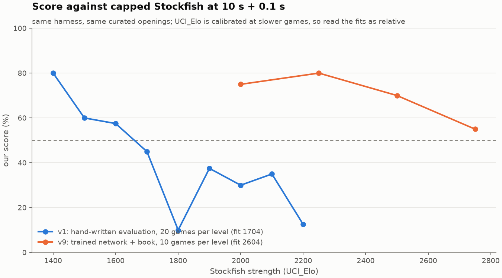

# ai-chessathon

Team **Claude's Gambit**'s entry for [AI Chessathon](https://aichessathon.com): a pure-Python
alpha-beta engine with a neural evaluation trained from scratch on a rented GPU, an opening book
of master games, and every measurement used to decide what went in.

<p align="center">
  
</p>

**Current build: v9b**, at the repo root. It plays a HalfKAv2_hm network (L1 1024) trained for
121 epochs on 12.1 billion positions. Against Stockfish capped with `UCI_Elo` at 10 s + 0.1 s,
v9 (the same engine before its book was trimmed to move 20) scored 75% at 2000, 80% at 2250, 70%
at 2500 and 55% at 2750. The hand-written v5 it replaced scored 45% at 1700. Last updated
11 Sep 2026.

## Contents

- [The competition](#the-competition)
- [The engine](#the-engine): search, the network, the opening book
- [Training the network](#training-the-network): data, GPU, curves, export
- [How strong it is](#how-strong-it-is)
- [Is it safe to submit](#is-it-safe-to-submit): limits and rules, checked
- [Search work after the deadline](#search-work-after-the-deadline)
- [Where the strength goes](#where-the-strength-goes)
- [Layout](#layout), [Running it](#running-it), [Fair play](#fair-play), [Next](#next)

## The competition

The whole submission is a zip with `agent.py` at its root, exposing one function:

```python
def get_move(fen: str, time_left_ms: int) -> str: ...
```

| | |
|---|---|
| Clock | 120 s + 0.5 s per move, per side, on wall time |
| Hardware | one core of an AMD EPYC 9V74 at 2.60 GHz, 2 GB RAM, no network, no GPU |
| Start-up | 90 s to import the agent, before the clock starts |
| Size | 50 MB unzipped, weights and books included |
| Environment | Python 3.12 with torch 2.13 (CPU), numpy 2.5, python-chess 1.11, onnxruntime 1.29, numba 0.67; no native binaries |
| Filesystem | read-only apart from 256 MB at `/tmp` |
| Openings | rated games start from curated positions, not the standard start |
| Networks | trained by the team; engine-labelled training data is allowed |
| Tables | opening tables for positions at move 20 or lower, endgame tables up to 7 pieces; anything that answers a middlegame counts as an engine |
| Schedule | hourly rated rounds from 4 Sep; uploads closed 11 Sep 11:00; a 13-round Swiss over locked builds that afternoon; live final 12 Sep in London |

[aichessathon.com/docs](https://aichessathon.com/docs) is canonical and changes.

## The engine

### Search

| Technique | What it does here |
|---|---|
| Iterative deepening, aspiration windows | Searches depth 1, 2, 3... and keeps the last finished result. Windows start ±40 cp around the previous score. |
| Principal variation search | Fail-soft negamax. Only the first move gets a full window. |
| Transposition table | 1M entries keyed on the position, depth-preferred replacement, kept across moves in a game. |
| Move ordering | TT move, then captures by MVV-LVA with losing captures demoted by static exchange evaluation (SEE), then killers, then history. |
| Internal iterative deepening | From depth 5, a node with no TT move runs a shallow search first to find one. |
| Null-move pruning | Skips a turn. If the position still fails high, prunes it. |
| Reverse futility, futility, late move pruning | Prune nodes whose static eval is far outside the window, up to depths 6, 4 and 5. |
| Late move reductions | Quiet moves late in the ordering search shallower, by a log-based table. |
| Mate distance pruning, check extensions | Prefer the shortest mate, and search one ply deeper when in check. |
| Quiescence search | Captures only, with stand-pat, delta pruning and SEE pruning of losing captures. |

Time management gives each move `time_left / 34` plus 85% of the increment, which the engine
measures rather than trusts, and switches to `/ 45` under 25 seconds. A timeout raises out of
the search and returns the last completed depth. At the real clock that is about 3 to 4 s a move
and depth 7 to 10.

<p align="center">
  
</p>

### Evaluation: a network trained from scratch

`nnue_eval.py` runs a **HalfKAv2_hm** network in the shape Stockfish's trainer produces, written
out and executed by our own code:

| Part | Shape |
|---|---|
| Inputs | 22,528 sparse features: 32 king buckets × 704 piece-square planes, mirrored so the king is always on files e to h |
| Feature transformer | 22,528 → 1,024 per side to move, plus 8 piece-square outputs; clamped to [0, 1], then the two halves of each side multiplied pairwise |
| Layer stacks | 8, chosen by piece count: 1,024 → 32 → 64 (squared and linear clipped ReLU) → 32 → 64 → output reading both hidden layers |
| Size | about 23.5M parameters; 23.07M of them in the feature transformer |

- **Inference** is numba. Each call rebuilds both accumulators from python-chess bitboards
  (de Bruijn bit scans, SWAR popcount) and costs about **42 µs**. Scores are cached by
  transposition key, 400,000 entries at most.
- **Weights** ship as `weights/nnue.pt`, 47,986,486 bytes: the feature transformer in float16,
  the rest in float32, computed in float32. Our forward pass matches nnue-pytorch's to
  **1.7e-6** in float32 and **7.5e-4** with the float16 weights. It gives the same score with
  colours swapped or files mirrored, to 5e-7.
- **Scale.** The search's pruning margins were tuned against the hand-written evaluation, pawn =
  100. A fit over 462 opening positions sets `TO_CENTIPAWNS = 100 / 288` for this net. The
  hand-written evaluation stays in `agent.py` as the fallback if the weights file is missing.

Why `.pt` and not Stockfish's `.nnue` format? The format does not change speed here: the same numba code runs
either way. We serialised the epoch-60 checkpoint both ways to compare: `.nnue` was 47.1 MB
uncompressed and 24.2 MB with its default LEB128 compression, against 48.0 MB for our `.pt`. The
rules name `.pt` as an accepted format, and the build fits the cap with the book included.

### Opening book

`book/hiarcs_ref.bin` is the **HIARCS Reference Book Lite**: games between players rated 2550 or
more up to 2009, with computer and correspondence games excluded. It shipped as Arena's `.abk`
tree, and `tools/abk_to_polyglot.py` converts it:

- walks all 2,346,362 tree entries through python-chess, with 0 illegal moves;
- merges transpositions and weights each move by the games it was played in;
- keeps moves played in at least 3 games, and **only positions at move 20 or lower**;
- leaves 64,688 moves over 51,565 positions, 1.04 MB.

The agent plays the most-played move without searching, but only when the move number is 20 or
lower. The book is **not in this repository**: HIARCS allows personal use and forbids hosting the
file elsewhere. Without it the agent prints `opening book: none` and searches from move one.

| Sample opening | gm2001 (tried in v8) | HIARCS, trimmed |
|---|---|---|
| French Winawer | 2 plies | 11 plies |
| Grunfeld Defence | 15 plies | 26 plies |
| Sicilian Sveshnikov | 11 plies | 24 plies |
| English, Petroff, Scotch, French Classical, Sicilian Closed | none | none |

## Training the network

### Data

The rules allow any training data, including positions scored by an engine, as long as the team
trains the network itself.

- **Source:** six binpacks, `500M_d9_p1` to `p6`, from
  [jshriver/historic-binpacks](https://huggingface.co/datasets/jshriver/historic-binpacks)
- **Size:** 500M positions each by name, so about **3.0 billion positions** and 7.4 GB (about
  2.4 bytes a position)
- **Labels:** Stockfish scores at depth 9
- **Loading:** downloaded in about 5 minutes to `/dev/shm` so the loader reads from RAM
  (`training/vast/get_data.sh`)
- **Filtering:** the loader skips the first 12 plies of each game, captures and positions in
  check, and a share of the rest by game result, so it passes over the files several times

### Pipeline

[official-stockfish/nnue-pytorch](https://github.com/official-stockfish/nnue-pytorch) at
`9f72946` (July 2026), run exactly as the trainer ships. Nothing started from an existing network:
no `--resume-from-model` and no engine test net.

| Setting | Value |
|---|---|
| Features | `HalfKAv2_hm^` (factorised during training, 24,576 inputs; exported to 22,528) |
| L1 | 1,024 |
| Target | `--lambda 1.0`: the engine's score only, not the game result |
| Batch | 16,384 positions |
| Epoch | 100M positions (6,103 steps) |
| Validation | 1M positions per epoch, sampled from the same files |
| Optimizer | Ranger-lite, learning rate 4.375e-4 × 0.995 per epoch |
| Loader | 12 C++ workers, 4 torch threads |

### The GPU box

| | |
|---|---|
| Provider | vast.ai, one rented container |
| GPU | **NVIDIA GeForce RTX 4090, 48 GB** (49,140 MiB), driver 580.142 |
| Software | torch 2.11.0 + CUDA 12.8, Python 3.12 |
| Host limits | about 18.9 CPUs by cgroup quota, 234 GB RAM, 16 GB overlay disk, 31 GB `/dev/shm` |
| Load while training | about 56% GPU utilisation at 246 W and 1.8 GB of GPU memory; the CPU data loader, not the GPU, set the pace |
| Throughput | about 1.4M positions a second, 55 to 75 s an epoch |
| Checkpoints | 529 MB each, one every 5 or 10 epochs plus `last.ckpt` |

| Step (UTC, 11 Sep) | Time | What |
|---|---|---|
| 06:08 to 06:13 | ~5 min | download 7.4 GB of binpacks |
| 06:13 to 07:22 | ~69 min | run 1: epochs 1 to 60 (`training/vast/train.sh`) |
| 07:22 to 08:00 | | export and test the epoch-60 net, which became v7 |
| 08:00 to 09:17 | ~77 min | run 2: resumed from `last.ckpt` at the learning rate it had reached, 3.25e-4, through epoch 121 (`training/vast/continue.sh`) |

About **2.5 GPU hours** of training in all, over **12.1 billion positions**.

### Curves

<p align="center">
  
</p>

| Epoch | 1 | 10 | 20 | 40 | 60 | 121 |
|---|---|---|---|---|---|---|
| Validation loss | 0.00343 | 0.00206 | 0.00188 | 0.00172 | 0.00166 | **0.00156** |



By epoch 60 the curve was gaining about 0.2% an epoch. The second run bought another 6%. Charts
come from `training/plot_curves.py` over the two `metrics.csv` files in `training/logs/`. The learning-rate chart is
in `docs/img/training/`.

### From checkpoint to agent

1. `training/export_halfka.py` loads the Lightning checkpoint into nnue-pytorch's model, coalesces
   the factorised features and layer stacks, and writes the float tensors `nnue_eval.py` reads.
2. `tools/nnue_sanity.py` checks it against positions with an obvious answer, and fits the
   centipawn scale:

| Position (side to move) | Epoch 60 | Epoch 121 |
|---|---|---|
| Start | +14 | +9 |
| White up a knight | +301 | +301 |
| White up a rook | +383 | +365 |
| White up a queen | +830 | +782 |
| Black up a queen | | −698 |
| KQ v K | | +489 |
| K+P v K, pawn on the 7th | +703 | +738 |
| Correlation with the hand-written evaluation, 462 positions | 0.90 | 0.90 |

The first attempt used our own pipeline, a 768-input net on the Lichess evaluation database
(`training/prepare.py`, `training/train.py`). It was dropped for nnue-pytorch before it trained.

## How strong it is

### Versions

Each version was measured head to head with `harness/arena.py` at 10 s + 0.1 s, unless noted.
Few games decide little; the ± is the 95% interval.

| Version | What changed | Measured |
|---|---|---|
| v1 | PVS, TT, null move, LMR, quiescence, tapered eval | 1704 Elo on the Stockfish ladder |
| v2a | SEE in ordering and quiescence; clock management rewritten | 50% vs Stockfish 1700 over 20 games (v1: 45%) |
| v3 | Reverse futility, futility and late move pruning; log LMR table | Folded into v4's test |
| v4 | Mate distance pruning; depth-preferred TT replacement | +108 Elo vs v2a, 65.0% over 20 games |
| v5 | Internal iterative deepening | +89 Elo vs v4, 62.5% over 16 games |
| v6 | The network after **one** epoch replaces the hand-written evaluation | +6 =1 −1 vs v5 (81%) |
| v7 | The epoch-60 network; evaluation cache | **8-0 vs v5; 8-0 vs Stockfish 1700** (v5 45%); **+3 =1 −0 vs Loki 3.0** (v4 0/8) |
| v8 | v7 + `gm2001.bin` book | +1 =3 −2 vs v7 on the three openings the book covers: no measurable change |
| v9 | The epoch-121 network; HIARCS book | +2 =3 −3 vs v8 (43.8% ± 28.9%): inconclusive; all three losses were search blunders, not book moves |
| **v9b** | v9 with the book limited to move 20 | the build at the root |

### Stockfish ladder

<p align="center">
  
</p>

v9 played 10 games at each of four `UCI_LimitStrength` levels, on the first five sample openings
with colours swapped. There were no illegal moves, timeouts or crashes.

| Stockfish `UCI_Elo` | 2000 | 2250 | 2500 | 2750 |
|---|---|---|---|---|
| W / D / L | 6 / 3 / 1 | 6 / 4 / 0 | 6 / 2 / 2 | 4 / 3 / 3 |
| v9's score | 75% | 80% | 70% | 55% |

Pooled through the logistic Elo model, that is **2604 (95% interval 2464 to 2750)**. Read it as a
relative scale:

- the scores fall far more slowly than the model predicts (97% expected at 2000, 30% at 2750),
  which points at `UCI_Elo` being poorly calibrated at 10-second games;
- each level is only 10 games;
- the tournament clock is 12× longer.

For comparison, v1 played 20 games at each of nine levels with the hand-written evaluation:

| Stockfish Elo | 1400 | 1500 | 1600 | 1700 | 1800 | 1900 | 2000 | 2100 | 2200 |
|---|---|---|---|---|---|---|---|---|---|
| v1's score | 80% | 60% | 57.5% | 45% | 10% | 37.5% | 30% | 35% | 12.5% |

### Rated games on the platform (v5)

| Round | Colour | Opponent | Result | Mean loss | Median loss | Blunders |
|---|---|---|---|---|---|---|
| 102 | White | The Biggest Blunderer | Draw, threefold repetition | 62.9 cp | 21 cp | 3 |
| 103 | Black | imperialists | Lost, checkmate | 79.5 cp | 23 cp | 3 |

Losses are centipawns given up per move against Stockfish at depth 16. On the match hardware v5
reached depth 8 to 10 at about 35k nodes per second.

## Is it safe to submit

Every check below was run on the zipped v9b, `submission-v9b-compliant.zip`.

| Check | Result |
|---|---|
| Size | 49,063,326 bytes unzipped, under 50,000,000 |
| Contents | `agent.py`, `nnue_eval.py`, `book/hiarcs_ref.bin`, `weights/nnue.pt`; no executables |
| Imports | standard library plus `chess`, `chess.polyglot`, `numpy`, `numba`, `torch`, matching the platform's versions exactly |
| Forbidden behaviour | no network, subprocess, threads or writes; numba `cache=False`; files read only from the agent folder |
| Import time | 4.3 to 7.6 s against the 90 s budget; the first move searched the same 40,253 nodes as a warm run, so nothing compiles on the clock |
| Memory | 403 MB after import; **920 MB peak** with the TT at 1M entries and the cache at 400,000, just before they clear (2 GB cap) |
| Clock | legal replies on all 8 sample openings with 120 s, 800 ms and 150 ms left; at 150 ms it answers instantly |
| Book | no entry past move 20 along any sample opening; the agent returns no book move at move 21 or later |
| Smoke games | both passed the same two games the platform plays on upload |
| Tactics | 24/24 of our tactics set at depth 7 |
| Style | ruff and mypy strict clean |

**The move-20 bug.** v9 as first built looked the book up at any move number. From the standard
start the book held answers as late as move 29, and from the sample Grunfeld start as late as move
21. The rules count a table that answers a middlegame as an engine. v9b trims the book to move 20
and adds the check. Anything built from v9 carries the same fix.

## Search work after the deadline

With the network in, the remaining gaps are speed and search efficiency: about 18k nodes a second
with the network on this laptop, and v4 needed about 2.6× the nodes Loki does to reach the same
depth. Three experiments, none adopted yet:

| Version | Change |
|---|---|
| v10 | Try the TT move before generating, scoring and sorting the rest |
| v11 | v10 + countermove heuristic + history malus for quiet moves that failed |
| v12 | v11 + TT ageing: between moves a full table drops entries the last 4 searches did not write, instead of being wiped |

`tools/bench.py` searched 32 positions (24 tactics, 8 openings) to depth 7, each with a fresh searcher:

| Version | Nodes | Time | Nodes/s | Tactics |
|---|---|---|---|---|
| v9b | 616,060 | 33.0 s | 18,641 | 24/24 |
| v10 | 585,669 | 32.1 s | 18,244 | 24/24 |
| v11 | 602,008 | 34.7 s | 17,334 | 24/24 |

Single positions swing by as much as ±110% between versions, and v11 was −5% on the tactics
against +6% on the openings. At this size the differences are noise. `tools/sequence.py` replayed
two 100-move games with one searcher each at depth 8. The table peaked at 431,459 entries, so the
1M wipe v12 fixes never happens at these node counts; it may in long games at the real clock.
Settling any of the three needs games.

## Where the strength goes

These were measured on v4 and v5, with the hand-written evaluation. They are why the evaluation
was replaced first.

### Mistakes

Stockfish re-scored 8,215 of v1's moves from the ladder games:

| | Opening | Middlegame | Endgame | All |
|---|---|---|---|---|
| Mean loss | 65.8 cp | 84.9 cp | 48.1 cp | 66.0 cp |
| Blunders (over 300 cp) | 4.2% | 5.6% | 2.7% | 4.1% |

The hand-written evaluation agreed with Stockfish's at **r = 0.21** over 3,241 positions. Its
main defect was compression toward zero: in round 102 it read +90 cp in a position Stockfish
scored +702.

### Search compared with Loki 3.0

[Loki 3.0](https://github.com/BimmerBass/Loki) is an open-source C++ engine and was the
highest-rated engine on the platform's leaderboard. Both engines were given the same positions
and depths:

| | Ours (Python) | Loki 3.0 (C++) |
|---|---|---|
| Effective branching factor | 2.3 to 2.7 | 2.6 to 2.8 |
| Tactics solved, of 24 | 23 | 23 |
| Median nodes to solve | 219 | 84 |

The search finds the same moves, and needs about 2.6× more nodes to get there. At a branching
factor near 2.5 that costs roughly one ply on every move.

### Speed

Profiling a 4-second middlegame search with the hand-written evaluation:

| Where the time goes | Share |
|---|---|
| Our code: `evaluate`, move ordering, `see`, `search` | 25% |
| python-chess (move generation, `push`, attack masks) and builtins | 43% |

python-chess generates legal moves about 24k times a second on this machine, so the engine runs
near the library's ceiling. The network costs more per node: about 18k nodes a second against
25k with the hand-written evaluation, and it was still worth several hundred Elo.

## Bugs that cost games

- **Illegal moves.** `board.push()` ran outside `try/finally`, so a timeout unwound past
  `board.pop()` and left the board off its root. 5 of 16 test games ended on an illegal move.
  Every push is now paired with a `finally: board.pop()`, and the chosen move is checked against a
  fresh board before it is returned.
- **Silent logs.** Output to a pipe is block-buffered and dies with the process. Every diagnostic
  print now flushes.
- **A book past move 20.** Described [above](#is-it-safe-to-submit); caught in the final checks.

## Layout

```
agent.py              the submission, v9b: search, book lookup, clock, hand-written fallback
nnue_eval.py          the network's forward pass in numba
weights/nnue.pt       the epoch-121 network (46 MB)
book/                 the HIARCS book, not in git; see tools/abk_to_polyglot.py
versions/v1 ... v12   each measured build, playable as an arena opponent (weights and books not in git)
versions/fixed        the engine stopped at FIXED_DEPTH, for depth-matched comparisons
versions/nodecap      the engine stopped at NODE_LIMIT nodes, for node-matched comparisons
training/vast/        the GPU box's setup, data, training and resume scripts
training/logs/        Lightning's metrics.csv for both runs
training/             export_halfka.py, plot_curves.py, and the abandoned first pipeline
tools/                make_media.py, bench.py, sequence.py, book_match.py, abk_to_polyglot.py, nnue_sanity.py
results/              Stockfish ladder data and fits, and the game in docs/img/game.gif
docs/img/             the GIFs and charts in this README
sparring/             Stockfish over UCI at SPAR_ELO, Loki 3.0.0 full strength and depth-pinned
baselines/            the starter's random, greedy, minimax and numba agents
harness/              local copy of the platform's protocol and clock, never edited
```

Kept out of git: `engines/` (the Loki binary), `analysis/` (ladder parsing and Stockfish diagnosis
from the v1 to v5 era), the opening books, per-version weights, zips, and game logs.

## Running it

```
make setup    # uv sync, python 3.12
make gate     # ruff, mypy and two games that must finish cleanly
make zip      # build submission.zip with weights/ and book/, then smoke it like the platform
```

Measure a change. A few games give a direction and 16 to 20 decide:

```
uv run python -m harness.arena --agent versions/v9b --opponent versions/v7 --games 16
SPAR_ELO=2500 uv run python -m harness.arena --agent versions/v9b --opponent sparring/stockfish --games 10
uv run python tools/bench.py versions/v10 7
```

The arena defaults to 10 s + 0.1 s. Add `--base-ms 120000 --increment-ms 500` for the real clock.
The Stockfish partner expects `stockfish` on `PATH` or a path in `SPAR_ENGINE`.

Rebuild the book from HIARCS's free download (personal use only):

```
uv run python tools/abk_to_polyglot.py HiarcsBookRef2550Lite.abk book/hiarcs_ref.bin 115000
```

Retrain the network on a CUDA box: `training/vast/setup.sh`, `get_data.sh`, `train.sh`, then
`continue.sh`, then `training/export_halfka.py` on the last checkpoint. Redraw the media with:

```
uv run --with pillow --with matplotlib python tools/make_media.py
uv run --with matplotlib python training/plot_curves.py training/logs/version_*_metrics.csv --out docs/img/training
```

## Fair play

- **Network:** trained by us from random initialisation with nnue-pytorch. The training data is
  Stockfish-scored positions, which the rules allow. No published network was fine-tuned,
  re-exported or used as a starting point.
- **Evaluator:** `nnue_eval.py` is our own implementation, not a port of an engine's inference.
- **Sparring:** Stockfish and Loki ran only as separate processes in local testing and were never
  imported, called or embedded by the agent. Loki is GPL-3.0 and is not redistributed here.
- **Book:** from human master games only, used only at move 20 or lower, and read with
  `chess.polyglot` as the rules suggest.

## Next

1. **Incremental accumulators.** Updating the feature transformer by the few features a move
   changes, instead of rebuilding it, removes most of the network's 42 µs a call.
2. **Settle v10 to v12 with games**, then history-aware LMR and time management that extends on
   a falling score.
3. **Numba move generation.** Raising the node-rate ceiling means replacing python-chess in the
   search loop, which is a rewrite.

## License

MIT, except the opening book and third-party engines, which are not included. Built on
[aichessathon-starter](https://github.com/advitrocks9/aichessathon-starter).
